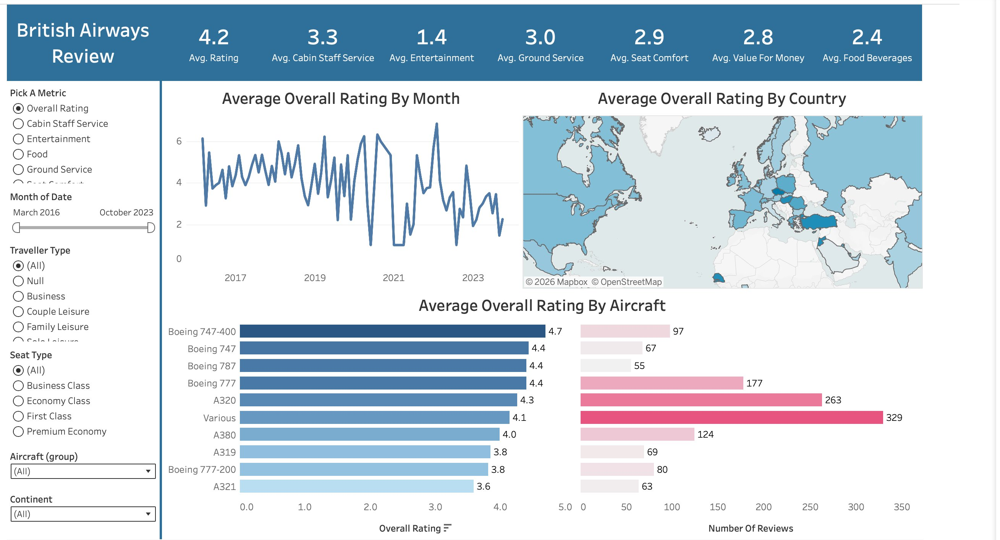

# British Airways Review Dashboard | Tableau

**Tools:** Tableau Public | Data Visualization | Customer Sentiment Analysis

---

## Live Dashboard

👉 [View Interactive Dashboard on Tableau Public](https://public.tableau.com/app/profile/bray.demonbreun/viz/BritishAirwaysReviewDataTableauProject2/Dashboard1)

---

## Overview

An interactive Tableau dashboard analyzing British Airways customer review data from March 2016 through October 2023. The dashboard enables dynamic exploration of passenger sentiment across multiple service dimensions, aircraft types, traveler categories, and geographic regions.

---

## Dashboard Preview



---

## Features

- **KPI Header** — at-a-glance averages across 7 key metrics: Overall Rating, Cabin Staff Service, Entertainment, Ground Service, Seat Comfort, Value for Money, and Food & Beverages
- **Average Overall Rating By Month** — time series trend line tracking rating fluctuations from 2016–2023, with a visible dip during the COVID-19 period (2020–2021)
- **Average Overall Rating By Country** — geographic map showing rating distribution across reviewer countries
- **Average Overall Rating By Aircraft** — dual bar chart comparing ratings and review volume across 10+ aircraft types

## Filters & Interactivity

The dashboard supports dynamic filtering across:
- **Metric selector** — switch between Overall Rating, Cabin Staff, Entertainment, Food, Ground Service, and Seat Comfort
- **Date range slider** — adjust the time window from March 2016 to October 2023
- **Traveller Type** — All, Business, Couple Leisure, Family Leisure, Solo Leisure
- **Seat Type** — All, Business Class, Economy Class, First Class, Premium Economy
- **Aircraft Group** — filter by specific aircraft model
- **Continent** — filter by reviewer region

---

## Key Insights

- Overall average rating of **4.2/10** across the full review period
- **Entertainment** rated lowest at **1.4** — a consistent pain point across all traveler types
- **Boeing 747-400** received the highest average rating **(4.7)** despite fewer reviews (97)
- Ratings show a notable decline trend from 2021 onward, suggesting post-COVID service recovery challenges
- **A320** and **Various** aircraft categories account for the highest review volumes (263 and 329 respectively)

---

## Data

- **Source:** British Airways customer reviews (aggregated review platform data)
- **Date Range:** March 2016 – October 2023
- **Metrics Tracked:** Overall Rating, Cabin Staff Service, Entertainment, Ground Service, Seat Comfort, Value for Money, Food & Beverages

---

## Files

```
├── images/
│   └── british_airways_dashboard.png   # Dashboard screenshot
└── README.md
```

> The full interactive dashboard is hosted on Tableau Public — click the link above to explore filters and drill-downs.
